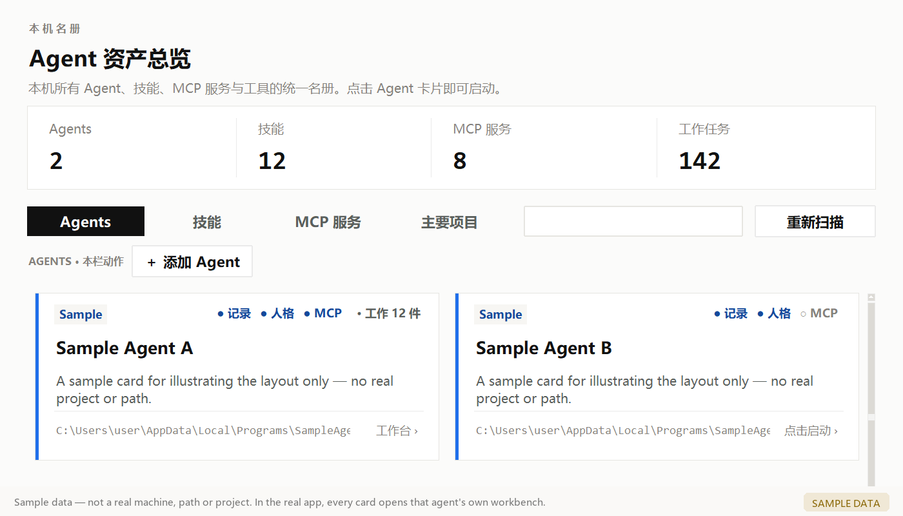

# Agent Asset Overview

[中文](README.md) ｜ **English**

> `AI agent inventory` · `MCP server` · `skill manager` · `record index` · local-first, no upload

Scans a Windows machine for the AI agents, skills, MCP servers and projects scattered across it —
and **indexes their memories and work records in place**, so the agents can look them up themselves.



> *Screenshots use placeholder data — no real paths or project names.*

## Download (Windows, no install)

Grab `AgentAssetOverview.exe` from the **[latest release](https://github.com/YOZODO349/agent-inventory/releases/latest)**:

- **No Python required**, nothing to configure; **no third-party dependencies** (the GUI is stdlib tkinter);
- On first launch it scans **this** machine; the inventory carries an origin stamp, so a file from
  someone else's computer is discarded and re-scanned;
- **One exe, two roles**: double-click for the GUI; launch it with `--mcp` and it is an
  **MCP server** — that is how other agents query your inventory;
- High-DPI aware (125/150/200%); window sizes are clamped to the usable screen area.

## Why

Anyone working with AI tools accumulates them: coding assistants, chat bots, image pipelines,
dozens of skills and MCP servers. The bigger problem is that **each one is amnesiac**:

- things you told agent A last week are unknown to agent B;
- a month later agent A itself has forgotten;
- and you no longer remember where "that project" actually stands.

So this tool does three things:

1. **Puts everything on one table** — agents, skills, MCP servers and main projects at a glance;
2. **Indexes their memories in place** — each agent's records are read *where they live*, no copies;
3. **Hands that index back to the agents** — via MCP, plus a **"search before answering, every turn"**
   rule written into each client's always-read place.

## Four columns

| Column | What it shows |
|---|---|
| **Agents** | Installed agent clients (built-in registry + shortcuts + a last-resort disk search + **marker-based auto-discovery**). Each card carries **three integration lights** (records / persona / MCP) and **the lights are clickable** — a dark light tells you what to fix. **Click the card for its workbench** |
| **Skills** | User-level and project-level skills (reads `SKILL.md` frontmatter); same-family skills collapse into one **bundle card** |
| **MCP servers** | Registrations from WorkBuddy / Cursor / Claude Desktop / AstrBot / Codex. **Only portable ones** — entries tied to a client's private runtime directory are filtered out |
| **Main projects** | The projects you care about: **implemented features, dev log, full artifact paths** on one page |

## Records: **indexed in place, never copied** (the big change in this release)

Records are read **where they already live**:

| Source | Location | Handling |
|---|---|---|
| WorkBuddy session memory | `~/WorkBuddy/*/.workbuddy/memory/` | direct |
| WorkBuddy long-term memory | `~/.workbuddy/memory/` | direct |
| **WorkBuddy session archives** | `~/.workbuddy/projects/*/*.jsonl` (10+ MB each) | **digest** |
| Codex notes | `~/.codex/memories/` | direct |
| Codex session transcripts | `~/.codex/sessions/**/*.jsonl` | **digest** |
| **AstrBot conversation memory** | `~/.astrbot/data/data_v4.db` (SQLite, tens of MB) | **digest** |
| AstrBot session workspaces | `~/.astrbot/data/workspaces/` | direct |
| Desktop text | `~/Desktop/*.md`, `*.txt` | direct |
| Curated records | `<app>/通用资源/工作记录/<Agent>/` | direct |
| **Anything you register** | see "let an agent report its own home" | direct or digest |

Three tiers:

- **direct** — search / workbench / MCP read them in place: nothing is copied, nothing goes stale,
  new content is searchable immediately;
- **digest** — too big or not meant for humans (10+ MB jsonl, SQLite databases) are summarised into
  readable text under `%LOCALAPPDATA%\Agent资产总览\digest缓存\` (**rebuildable at any time,
  never the only copy**);
- **register only** — private binary formats (e.g. Cursor's workspaceStorage) are located, not read.

> **Why transcription is gone**: copying required getting every source path right, and
> **one missed source meant records that could never be found** (we hit that four times).
> In-place indexing cannot "miss" a source, and stores no second copy.

### Let an agent report its own home

No need to guess where each client keeps things — **ask it**:

1. Open an agent's **workbench** → click **【检索地址】** → "复制自报家门问话";
2. Paste that prompt into the agent's chat; it reports its own memory/record folders
   (absolute paths, file counts, sizes, text or binary);
3. Back in the app, click **【＋ 添加地址】**, pick the folder and confirm
   (the app probes the size and suggests direct-read vs. digest).

Registered locations become searchable **immediately**.

## Let agents query it: **MCP server + "search every turn"**

### Eight tools (all scanning locally; only matching snippets enter the context)

| Tool | What it does |
|---|---|
| `inventory_index` | **A one-page index** (~266 tokens): record sources with file counts / latest dates, plus main projects |
| `inventory_overview` | Machine overview: column counts, main projects, who worked in the last 7 days |
| `inventory_search` | Full-text search across all columns and **every agent's work records** (file, line, context) |
| `inventory_project` | One project in full: implemented features / dev log / full artifact paths |
| `inventory_agents` | Agent roster (executable, record folder, blurb) |
| `inventory_recent` | What each agent did in the last N days |
| `inventory_skills` | Skill library search |
| `inventory_reindex` | Re-scan the machine (optionally rebuild the digest cache) |

### Why it is cheap

**The full scan runs in a local process; only the matching snippet enters the model context.**
A typical search returns a few hundred characters from a corpus of tens of megabytes — so the
token cost does **not** grow with the library.

### "Search before answering, every turn"

Having the tools is not enough — agents must actually use them, so a rule is written into each
client's always-read place:

> **Every turn, before answering, search first** — don't wait for the user to say "do you remember...".
> Start with `inventory_index()`, then `inventory_search(...)` with the keywords; only read further on a hit.

Written automatically into: **AstrBot** (persona, stored in SQLite), **WorkBuddy**
(`SOUL.md` / `MEMORY.md` / `AGENTS.md`), **Codex** (`AGENTS.md`). Clients that read no such file
(Claude Desktop / Cursor / ComfyUI) get the text via "复制指针原文" to paste into their settings.

## Every agent gets a workbench

- **Workbench**: blurb on top, the agent's record list below;
- **Search paths (【检索地址】)**: let it report its own home, paste the folders in (see above);
- **Record sources (【记录来源】)**: one page showing where every record lives (built-in + yours),
  plus cleanup of leftover duplicate copies;
- **Attach agents (【接入 Agent】)**: registers the MCP server and drops the
  "search every turn" pointer; includes a **self-check prompt** and a
  "copy the read guide (MCP-free)" button;
- **Editable blurb**: stored in `agent_intros.json`, kept across re-scans.

## UI and interaction

- **Hover help** on buttons (attached per widget class, so **buttons added later get one automatically**);
- **Shortcuts**: `Ctrl+F` search ｜ `F5` / `Ctrl+L` rescan ｜ `Ctrl+1..4` switch column ｜
  `Ctrl+P` project settings ｜ `Esc` clear search;
- Empty columns hide themselves, tab included; anything not found is simply not shown;
- Restrained palette: warm white, hairline borders (`#eaeaea`), near-black text (`#111111`) —
  colour is reserved for meaning.

## Quick start (from source)

Windows, Python 3.9+, **no third-party dependencies**. [uv](https://docs.astral.sh/uv/) recommended:

```bash
winget install --id=astral-sh.uv -e     # or: pip install uv
git clone https://github.com/YOZODO349/agent-inventory.git
cd agent-inventory
uv run python src/agent_inventory_app.py
```

These files in `src/` **must stay together** (the program resolves them relative to itself):

```
agent_inventory_app.py   main program (GUI)
glass_widget.py          the card widget
scan_agents.py           collector: skills / MCP
scan_agents_apps.py      collector: agent clients / record-root registry / in-place index
agent_mcp.py             MCP server (stdio, implemented with the standard library only)
agent_onboard.py         attach MCP + write persona pointers + the self-report skill
```

### Registering the MCP server

The server command is that one exe (or python when running from source):

```jsonc
// e.g. ~/.workbuddy/mcp.json, ~/.cursor/mcp.json, Claude Desktop config
{"mcpServers": {"agent-inventory": {"command": "D:\\path\\AgentAssetOverview.exe",
                                   "args": ["--mcp"]}}}
```

> **AstrBot is special**: it keeps an allow-list of stdio launchers (`python`, `node`, ...),
> so use `"command": "<python.exe>", "args": ["<app>\\agent_mcp.py"]`
> (see its `core/agent/mcp_client.py`).
>
> The GUI's **接入 Agent** does all of the above for you (every file it touches is backed up first,
> and the change list is shown in the window).

## Build a single-file exe

```bash
uv run pyinstaller --noconfirm scripts/build_exe.spec
```

Result: `dist/AgentAssetOverview.exe`.

- The spec uses `console=True` because **the MCP stdio channel is unreliable in windowed mode**
  (PyInstaller treats `sys.stdout` as unusable there);
- the GUI hides that console window on startup (`_hide_console()`), so it looks unchanged.

## Directory layout (after running)

The app grows these **next to itself** (local data, never committed):

```
通用资源\\skills\\                the skill library (other shelves hold links to it)
通用资源\\工作记录\\<Agent>\\      curated records per agent (one of the indexed roots)
通用资源\\安卓模拟器MCP\\           self-contained Android toolchain, if you deployed one
主要项目.json                        the projects you track
agent_intros.json                   the blurbs you wrote
MCP设置.json                        masking / auto-attach switches
```

Two more live in your user profile:

```
%LOCALAPPDATA%\\Agent资产总览\\digest缓存\\    digests of oversized sources (rebuildable)
%LOCALAPPDATA%\\Agent资产总览\\检索地址.json     the search paths you registered
```

## Extending it

Edit `src/scan_agents_apps.py`; copy the existing shapes:

| Constant | Purpose |
|---|---|
| `KNOWN` | Registry of known agent clients (`@HOME@` placeholder; `hidden: True` keeps an entry off the list) |
| `SIGNATURES` | Per-client "real body" file names, used when a registered path no longer matches |
| `RECORD_ROOTS` | **The record-root registry**: where each agent's records live and how to handle them (direct / digest / register-only) |
| `LOG_SOURCES` | The old transcription sources (superseded by `RECORD_ROOTS`, kept for reference) |

## About the inventory files

`src/agents.json` and `src/agent_inventory.json` are **runtime artifacts** collected from your own
machine: they contain your user-name paths and installed skills. They are listed in `.gitignore` —
**please do not commit them**. Every launch checks their origin stamp and re-scans when they came
from another computer.

## License

[MIT](LICENSE)
