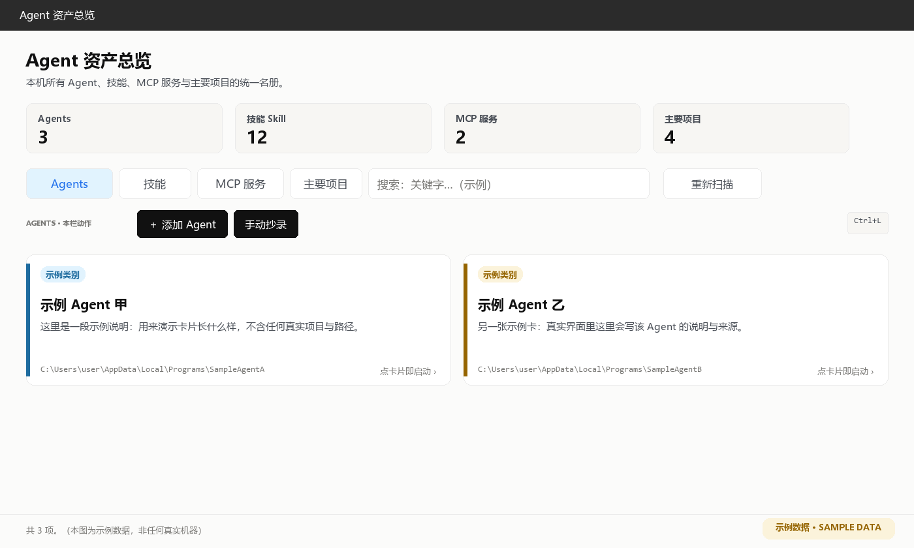

# Agent 资产总览 · Agent Asset Overview

**中文** ｜ [English](README.en.md)

> `AI agent inventory` · `MCP server` · `skill manager` · `record index` · 本地优先、不上传

把一台 Windows 电脑上散落的 **AI Agent、技能、MCP 服务与主要项目**扫成一张名册 ——
并且把它们的**记忆与工作记录就地索引起来**，**交给它们自己查**。



## 本版大改（v0.6.0）：从「仓库」变回「交换机」

这一版把上一版留下的一个包袱**整块拆掉了**，并重排了工作台。

1. **废掉「一格一 Agent 的工作记录夹」** —— 上一版让每个 Agent 把整理稿交进
   `<应用目录>/通用资源/工作记录/<Agent>/`。实践证明这层**预付款不划算**：
   要催、会过期、漏写就永远查不到。本版**只认各家原生位置**（就地读），
   应用不再自留一格，也不再产出 `works_dir`；搜索与项目页的原料全部改回原生记录。
2. **工作台重排**（每个 Agent 一页）：
   - **打开本体目录** —— 一键开它本体所在的**总目录**；
   - **手动添加检索地址** —— 原来的「＋添加检索地址」与「复制自报家门问话」**合并成一枚**：
     点开即摊开一层提示（含可直接粘给该 Agent 的提示词 + 「选择目录加入…」）；
   - **接入 Agent** 从首页搬进工作台，并且**只对这一个 Agent** 生效；
   - **地址清单一律常态摊开**，且**不再区分内置 / 手工**（都是它记录所在之处）；
     手工登记的那条可右键移除。
3. **撤掉「记录来源」窗** —— 内容已在各工作台里；卡片上「记录」灯改为**点开该 Agent 的工作台**。
4. **「主要项目」升格为「人划的重点」**：新增 **【编辑我划的重点】**，写一份人工清单，
   **优先于**自动摘录显示给人看；自动摘录处一律标注「自动摘录，供定位」。
5. **让 Agent 先查主要项目**：接入指引与 MCP 提示都改成
   `inventory_index`（目录页，约 266 token）→ **命中主要项目就 `inventory_project`**
   → 没命中再 `inventory_search`。项目全貌也**瘦身**了（功能 8 / 开发日志 8 / 任务 5 条）。
6. **首页右上角可摆一张配图 + 一条横贯粗线**（默认关闭，见源码里的 `HOME_ART_*` 常量；
   那条线的位置与粗细**从图上现量**，换图会自动跟着变）。
7. 若干界面修正：首页统计条不再塌成一张巨卡；工作台的启动键挪到页头；
   悬停说明可指定弹出方向（默认仍在控件正上方）。

> 升级提示：旧版在应用目录下留的 `通用资源/工作记录/<Agent>/` 已不再被读取，
> **可以整个删掉或自己归档**，不影响任何功能。


> *截图为示例数据，不含任何真实路径与项目名。*

## 下载（Windows 免安装）

到 **[Releases](https://github.com/YOZODO349/agent-inventory/releases/latest)** 下载
`AgentAssetOverview.exe`，双击即用：

- **不需要装 Python**，不需要配任何环境；**零第三方依赖**（界面只用标准库 tkinter）；
- 首次运行自动扫描**你这台机器**；名册带「产地戳」，别人带来的底册会被识破并弃用重扫；
- **一枚 exe 两个身份**：双击 = 图形界面；带 `--mcp` 启动 = **MCP 服务端**（各 Agent 用它来查你的资产）；
- 高 DPI 屏（125%/150%/200%）原生渲染不糊；窗口尺寸自动夹进屏幕可用区。

## 它想解决什么

用 AI 的人，机器上不知不觉装了一堆东西：编程助手、聊天机器人、绘图工作流、各种技能与 MCP 服务。
更麻烦的是 —— **它们各自失忆**：

- 你上周跟 A 说的事，B 不知道；
- 过一个月，连 A 自己也想不起来了；
- 你自己也记不清"那个项目到底做到哪一步了"。

所以这个工具做三件事：

1. **摆成一张桌子** —— 本机的 Agent / 技能 / MCP 服务 / 主要项目，一屏看尽；
2. **就地索引它们的记忆** —— 各家的记录**长在哪儿就读哪儿**，不复制副本；
3. **把这份索引交给它们自己用** —— 接上 MCP，并在它们每次必读处写一条
   **「每轮先查再答」**的规则。

## 四栏名册

| 栏目 | 内容 |
|---|---|
| **Agents** | 本机的 Agent 客户端（内置登记表 + 快捷方式 + 全盘寻真身 + **按特征自动发现**）。卡片右上角有**三盏接入灯**（记录 / 人格 / MCP），**灯能点** —— 暗灯点一下就知道该补什么。**点卡片进工作台** |
| **技能** | 用户级与项目级技能（读 `SKILL.md` 的 frontmatter）；同源成套的收成一张**整合卡** |
| **MCP 服务** | 各家客户端的 MCP 注册（WorkBuddy / Cursor / Claude Desktop / AstrBot / Codex）。**只收通用项** —— 绑死在某个客户端私有运行时目录里的会被剔除 |
| **主要项目** | 你划重点的项目：**已实现的功能、开发日志、产物完整路径**，一页看尽。项目页还带一枚 **【编辑我划的重点】** —— 人工写的清单**优先于**自动摘录 |

## 记录：**就地索引，不抄副本**（本版最大改动）

各家的记录**存放在哪，就直接读哪**：

| 来源 | 位置 | 处理 |
|---|---|---|
| WorkBuddy 会话记忆 | `~/WorkBuddy/*/.workbuddy/memory/` | 直接读 |
| WorkBuddy 长期记忆 | `~/.workbuddy/memory/` | 直接读 |
| **WorkBuddy 会话存档** | `~/.workbuddy/projects/*/*.jsonl`（单个可达十多 MB）| **摘录** |
| Codex 笔记 | `~/.codex/memories/` | 直接读 |
| Codex 会话实录 | `~/.codex/sessions/**/*.jsonl` | **摘录** |
| **AstrBot 对话记忆** | `~/.astrbot/data/data_v4.db`（SQLite，几十 MB）| **摘录** |
| AstrBot 会话工作区 | `~/.astrbot/data/workspaces/` | 直接读 |
| 桌面文本 | `~/Desktop/*.md`、`*.txt` | 直接读 |
| **你自己登记的位置** | 见下「让 Agent 自报家门」 | 直读或摘录 |

三档处理：

- **直接读** —— 搜索 / 工作台 / MCP 全都就地读，**不复制、不落后**，新写的内容立刻可查；
- **摘录** —— 太大或不是给人读的（十几 MB 的 jsonl、SQLite 库），摘成可读文本放进
  `%LOCALAPPDATA%\Agent资产总览\digest缓存\`（**可随时重建，不是唯一副本**）；
- **只登记** —— 私有二进制格式（如 Cursor 的 workspaceStorage），只标出位置。

> **为什么不再"抄录"**：抄录要事先把每个来源都写对，**漏一处就永远抄不到**（真栽过四次）；
> 就地索引没有"漏抄"这回事，也不存第二份。

### 让 Agent 自报家门（补上我猜不到的地方）

不必猜各家目录结构 —— **问它自己**：

1. 打开某 Agent 的**工作台** → 点 **【手动添加检索地址】**；
2. 摊开的那层提示里就有**现成的提示词** → 点「复制提示词」发给那个 Agent →
   它会报出自己记忆/记录的目录（绝对路径、文件数、体量、文本还是二进制）；
3. 拿到地址后，逐个点 **【选择目录加入…】** → 选目录 → 按提示确认
   （应用先探测体量，建议「直读」还是「摘录」）。

登记完 **立刻纳入检索** ✓

## 让 Agent 自己来查：**MCP 服务 + 每轮先查再答**

### 八个工具（都在本地扫，只有命中片段进模型上下文）

| 工具 | 作用 |
|---|---|
| `inventory_index` | **一页目录**（约 266 token）：各记录来源的文件数与最近日期 + 主要项目清单 |
| `inventory_overview` | 本机总览：四栏计数 + 主要项目 + 近 7 天谁在干活 |
| `inventory_search` | 四栏 + **各 Agent 工作记录**全文检索（回文件名·行号·上下文）|
| `inventory_project` | 某项目全貌：已实现功能 / 开发日志 / 产物完整路径（**命中主要项目时先查它最省**；人工写的「我划的重点」优先，自动摘录处会标注）|
| `inventory_agents` | Agent 名册（可执行文件、记录目录、简介）|
| `inventory_recent` | 最近 N 天各 Agent 干了什么 |
| `inventory_skills` | 技能库检索 |
| `inventory_reindex` | 重扫本机（可顺手重建摘录缓存）|

### 省 token 的原理

**全盘搜索在本地工具进程里跑，进模型上下文的只有命中片段** —— 实测一次检索回几百字，
而全库有十几 MB。所以库再大，**你的 token 花费不变**。

### 「每轮先查再答」

接上 MCP 只是把工具放在它手边；**要它主动用，还得写一条规则**。应用会把这条写进
各 Agent 每次必读的地方：

> **每一轮对话，在回答之前都先查一遍** —— 不要等对方说「还记不记得」。
> 先 `inventory_index()` 看目录，再按关键词 `inventory_search(...)`，命中才细读。

已支持自动写入：**AstrBot**（人格，存 SQLite）、**WorkBuddy**（`SOUL.md` / `MEMORY.md` / `AGENTS.md`）、
**Codex**（`AGENTS.md`）。不读这类文件的客户端（Claude Desktop / Cursor / ComfyUI 等）
窗口里有「复制指针原文」，人工粘进它的设置即可。

## 每个 Agent 都有自己的工作台

每张 Agent 卡片点进去就是它的工作台，工具条只有四件事：

- **启动 &lt;Agent&gt;**（页头）：开它的本体；
- **打开本体目录**：一键开它本体所在的**总目录**；
- **手动添加检索地址**：摊开一层提示 —— 可复制的提示词 + 「选择目录加入…」（见上）；
- **接入 Agent**：**只给这一个**接 MCP、放「每轮先查再答」指针，并给出自检提示词与
  「复制读取指引（免 MCP）」；
- **正文**：它的**数据文件地址**一条条摊开（内置与手工**一视同仁**），
  **点任一行路径即打开该位置**，手工登记的那条可**右键移除**；
- **可编辑简介**：每个 Agent 都能写一段自己的简介，存 `agent_intros.json`，重扫不会丢。

## 界面与交互

- **悬停说明**：鼠标停在按钮上即弹一句话说明 —— 按控件类接管，**以后新加的按钮自动生效**；可指定弹在控件上方或左侧；
- **首页配图**（可选）：`HOME_ART_*` 常量指向一张本地图片，它会被等比例缩到
  「页头 + 统计条」那块大小摆在右上角，并可附一条横贯全宽的粗线；**默认关闭**；
- **快捷键**：`Ctrl+F` 聚焦搜索 ｜ `F5`／`Ctrl+L` 重新扫描 ｜ `Ctrl+1..4` 切栏 ｜
  `Ctrl+P` 设置主要项目 ｜ `Esc` 清空搜索；
- **空栏目连页签一起隐去**；没检索到的东西不摆出来；
- 配色克制：暖白底 + 超淡边（`#eaeaea`）+ 近黑字（`#111111`），颜色只用于语义。

## 快速开始（从源码跑）

需要 **Windows + Python 3.9+**，**没有第三方依赖**。推荐用 [uv](https://docs.astral.sh/uv/)：

```bash
winget install --id=astral-sh.uv -e     # 或: pip install uv
git clone https://github.com/YOZODO349/agent-inventory.git
cd agent-inventory
uv run python src/agent_inventory_app.py
```

`src/` 里这几个文件**必须在同一目录**（程序以自身位置为基准找它们）：

```
agent_inventory_app.py   主程序（图形界面）
glass_widget.py          卡片控件
scan_agents.py           采集器：技能 / MCP
scan_agents_apps.py      采集器：Agent 客户端 / 记录根登记表 / 就地索引
agent_mcp.py             MCP 服务端（stdio，纯标准库实现）
agent_onboard.py         接 MCP + 放人格指针 + 自报家门技能
```

### 把 MCP 服务接进各客户端

服务端命令就是那一枚 exe（或源码运行时用 python）：

```jsonc
// 例：~/.workbuddy/mcp.json、~/.cursor/mcp.json、Claude Desktop 配置
{"mcpServers": {"agent-inventory": {"command": "D:\\path\\AgentAssetOverview.exe",
                                   "args": ["--mcp"]}}}
```

> **AstrBot 另有讲究**：它对 stdio MCP 的启动命令有白名单（只认 `python`/`node` 之类），
> 故要写 `"command": "<python.exe>", "args": ["<应用目录>\\agent_mcp.py"]`，
> 见它的 `core/agent/mcp_client.py`。
>
> 图形界面的 **接入 Agent** 会把上面这些改动代办好（改前一律备份，
> 改动清单在窗口里可见）。

## 打包成单文件 exe

```bash
uv run pyinstaller --noconfirm scripts/build_exe.spec
```

产物 `dist/AgentAssetOverview.exe`。

- 规格里 `console=True` —— 因为 **MCP 的 stdio 通道在窗口模式下不可靠**
  （PyInstaller 会把 `sys.stdout` 当作不可用）；
- 图形界面启动时**自行隐藏**那枚控制台窗口（`_hide_console()`），观感与从前一致。

## 目录结构（跑起来之后）

程序会在**自己旁边**长出这些（都是本机数据，不进版本库）：

```
通用资源\skills\                技能库真身（各家技能架里留的是指向这里的链接）
通用资源\安卓模拟器MCP\          自带运行时的安卓工具链（若你部署过）
主要项目.json                     你设的主要项目
agent_intros.json                你写的 Agent 简介
MCP设置.json                     脱敏开关 / 自动接入开关
```

用户目录那边还有两处（与本应用相关）：

```
%LOCALAPPDATA%\Agent资产总览\digest缓存\    摘录出来的可读文本（可随时重建）
%LOCALAPPDATA%\Agent资产总览\检索地址.json   你登记的检索地址
```

## 想加自己的东西

改 `src/scan_agents_apps.py`，格式照抄：

| 常量 | 用途 |
|---|---|
| `KNOWN` | 已知 Agent 客户端登记表（路径用 `@HOME@` 占位；`hidden: True` 表示不上架）|
| `SIGNATURES` | 各客户端的「真身」特征名，登记路径落空时靠它全盘找 |
| `RECORD_ROOTS` | **记录根登记表**：哪个 Agent 的记录在哪、怎么处理（直读 / 摘录 / 只登记）|

## 关于名册文件

`src/agents.json` 与 `src/agent_inventory.json` 是**运行期产物**，采自你自己的电脑：
里面有你的用户名路径与你装的技能清单。已在 `.gitignore` 中忽略，**请勿提交**。
每次启动都会检查它们的「产地戳」，不是本机的就整份弃用重扫。

## 许可

[MIT](LICENSE)
